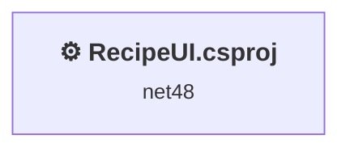
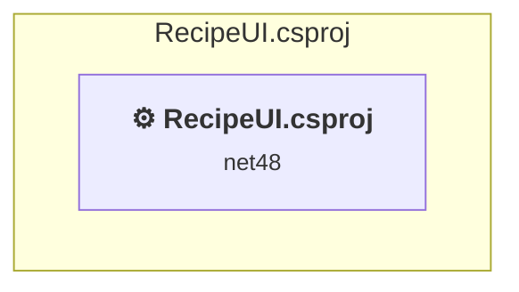

# Projects and dependencies analysis

This document provides a comprehensive overview of the projects and their dependencies in the context of upgrading to .NETCoreApp,Version=v10.0.

## Table of Contents

- [Executive Summary](#executive-Summary)
  - [Highlevel Metrics](#highlevel-metrics)
  - [Projects Compatibility](#projects-compatibility)
  - [Package Compatibility](#package-compatibility)
  - [API Compatibility](#api-compatibility)
- [Aggregate NuGet packages details](#aggregate-nuget-packages-details)
- [Top API Migration Challenges](#top-api-migration-challenges)
  - [Technologies and Features](#technologies-and-features)
  - [Most Frequent API Issues](#most-frequent-api-issues)
- [Projects Relationship Graph](#projects-relationship-graph)
- [Project Details](#project-details)

  - [RecipeMan\RecipeUI.csproj](#recipemanrecipeuicsproj)

## Executive Summary

### Highlevel Metrics

| Metric | Count | Status |
| :--- | :---: | :--- |
| Total Projects | 2 | All require upgrade |
| Total NuGet Packages | 4 | All compatible |
| Total Code Files | 23 |  |
| Total Code Files with Incidents | 11 |  |
| Total Lines of Code | 2205 |  |
| Total Number of Issues | 1300 |  |
| Estimated LOC to modify | 1298+ | at least 58.9% of codebase |

### Projects Compatibility

| Project | Target Framework | Difficulty | Package Issues | API Issues | Est. LOC Impact | Description |
| :--- | :---: | :---: | :---: | :---: | :---: | :--- |
| [RecipeMan\RecipeUI.csproj](#recipemanrecipeuicsproj) | net48 | 🟡 Medium | 0 | 1298 | 1298+ | ClassicWinForms, Sdk Style = False |

### Package Compatibility

| Status | Count | Percentage |
| :--- | :---: | :---: |
| ✅ Compatible | 4 | 100.0% |
| ⚠️ Incompatible | 0 | 0.0% |
| 🔄 Upgrade Recommended | 0 | 0.0% |
| ***Total NuGet Packages*** | ***4*** | ***100%*** |

### API Compatibility

| Category | Count | Impact |
| :--- | :---: | :--- |
| 🔴 Binary Incompatible | 1244 | High - Require code changes |
| 🟡 Source Incompatible | 45 | Medium - Needs re-compilation and potential conflicting API error fixing |
| 🔵 Behavioral change | 9 | Low - Behavioral changes that may require testing at runtime |
| ✅ Compatible | 3735 |  |
| ***Total APIs Analyzed*** | ***5033*** |  |

## Aggregate NuGet packages details

| Package | Current Version | Suggested Version | Projects | Description |
| :--- | :---: | :---: | :--- | :--- |
| JsonConverter.Abstractions | 0.8.0 |  | [RecipeUI.csproj](#recipemanrecipeuicsproj) | ✅Compatible |
| JsonConverter.Newtonsoft.Json | 0.8.0 |  | [RecipeUI.csproj](#recipemanrecipeuicsproj) | ✅Compatible |
| Newtonsoft.Json | 13.0.4 |  | [RecipeUI.csproj](#recipemanrecipeuicsproj) | ✅Compatible |
| Stef.Validation | 0.1.1 |  | [RecipeUI.csproj](#recipemanrecipeuicsproj) | ✅Compatible |

## Top API Migration Challenges

### Technologies and Features

| Technology | Issues | Percentage | Migration Path |
| :--- | :---: | :---: | :--- |
| Windows Forms | 1244 | 95.8% | Windows Forms APIs for building Windows desktop applications with traditional Forms-based UI that are available in .NET on Windows. Enable Windows Desktop support: Option 1 (Recommended): Target net9.0-windows; Option 2: Add <UseWindowsDesktop>true</UseWindowsDesktop>; Option 3 (Legacy): Use Microsoft.NET.Sdk.WindowsDesktop SDK. |
| GDI+ / System.Drawing | 41 | 3.2% | System.Drawing APIs for 2D graphics, imaging, and printing that are available via NuGet package System.Drawing.Common. Note: Not recommended for server scenarios due to Windows dependencies; consider cross-platform alternatives like SkiaSharp or ImageSharp for new code. |
| Legacy Configuration System | 2 | 0.2% | Legacy XML-based configuration system (app.config/web.config) that has been replaced by a more flexible configuration model in .NET Core. The old system was rigid and XML-based. Migrate to Microsoft.Extensions.Configuration with JSON/environment variables; use System.Configuration.ConfigurationManager NuGet package as interim bridge if needed. |

### Most Frequent API Issues

| API | Count | Percentage | Category |
| :--- | :---: | :---: | :--- |
| T:System.Windows.Forms.Button | 167 | 12.9% | Binary Incompatible |
| T:System.Windows.Forms.Label | 71 | 5.5% | Binary Incompatible |
| P:System.Windows.Forms.Control.Location | 70 | 5.4% | Binary Incompatible |
| P:System.Windows.Forms.Control.Width | 64 | 4.9% | Binary Incompatible |
| T:System.Windows.Forms.TextBox | 52 | 4.0% | Binary Incompatible |
| T:System.Windows.Forms.ListView | 47 | 3.6% | Binary Incompatible |
| T:System.Windows.Forms.DialogResult | 44 | 3.4% | Binary Incompatible |
| P:System.Windows.Forms.Label.Text | 31 | 2.4% | Binary Incompatible |
| T:System.Windows.Forms.FormStartPosition | 30 | 2.3% | Binary Incompatible |
| E:System.Windows.Forms.Control.Click | 27 | 2.1% | Binary Incompatible |
| P:System.Windows.Forms.ButtonBase.Text | 27 | 2.1% | Binary Incompatible |
| M:System.Windows.Forms.Button.#ctor | 27 | 2.1% | Binary Incompatible |
| P:System.Windows.Forms.Control.Height | 24 | 1.8% | Binary Incompatible |
| M:System.Windows.Forms.Label.#ctor | 23 | 1.8% | Binary Incompatible |
| P:System.Windows.Forms.TextBox.Text | 16 | 1.2% | Binary Incompatible |
| T:System.Windows.Forms.ListBox | 16 | 1.2% | Binary Incompatible |
| P:System.Windows.Forms.Form.Text | 15 | 1.2% | Binary Incompatible |
| P:System.Windows.Forms.Control.Enabled | 14 | 1.1% | Binary Incompatible |
| P:System.Windows.Forms.Label.AutoSize | 13 | 1.0% | Binary Incompatible |
| T:System.Windows.Forms.PictureBox | 13 | 1.0% | Binary Incompatible |
| M:System.Windows.Forms.Form.#ctor | 12 | 0.9% | Binary Incompatible |
| T:System.Windows.Forms.ScrollBars | 12 | 0.9% | Binary Incompatible |
| T:System.Windows.Forms.ListViewItem | 12 | 0.9% | Binary Incompatible |
| T:System.Windows.Forms.View | 12 | 0.9% | Binary Incompatible |
| T:System.Windows.Forms.Control.ControlCollection | 11 | 0.8% | Binary Incompatible |
| P:System.Windows.Forms.Control.Controls | 11 | 0.8% | Binary Incompatible |
| T:System.Windows.Forms.ListView.ColumnHeaderCollection | 11 | 0.8% | Binary Incompatible |
| P:System.Windows.Forms.ListView.Columns | 11 | 0.8% | Binary Incompatible |
| T:System.Windows.Forms.ColumnHeader | 11 | 0.8% | Binary Incompatible |
| M:System.Windows.Forms.ListView.ColumnHeaderCollection.Add(System.String,System.Int32) | 11 | 0.8% | Binary Incompatible |
| F:System.Windows.Forms.FormStartPosition.CenterParent | 10 | 0.8% | Binary Incompatible |
| P:System.Windows.Forms.Form.StartPosition | 10 | 0.8% | Binary Incompatible |
| T:System.Drawing.Image | 10 | 0.8% | Source Incompatible |
| T:System.Windows.Forms.ListView.ListViewItemCollection | 10 | 0.8% | Binary Incompatible |
| P:System.Windows.Forms.ListView.Items | 10 | 0.8% | Binary Incompatible |
| T:System.Windows.Forms.ListView.SelectedIndexCollection | 10 | 0.8% | Binary Incompatible |
| P:System.Windows.Forms.ListView.SelectedIndices | 10 | 0.8% | Binary Incompatible |
| F:System.Windows.Forms.DialogResult.OK | 9 | 0.7% | Binary Incompatible |
| M:System.Windows.Forms.TextBox.#ctor | 9 | 0.7% | Binary Incompatible |
| T:System.Drawing.ContentAlignment | 9 | 0.7% | Source Incompatible |
| T:System.Windows.Forms.ComboBox | 8 | 0.6% | Binary Incompatible |
| M:System.Windows.Forms.Form.Close | 7 | 0.5% | Binary Incompatible |
| M:System.Windows.Forms.Form.ShowDialog(System.Windows.Forms.IWin32Window) | 7 | 0.5% | Binary Incompatible |
| M:System.Windows.Forms.Control.ControlCollection.Add(System.Windows.Forms.Control) | 7 | 0.5% | Binary Incompatible |
| T:System.Windows.Forms.NumericUpDown | 7 | 0.5% | Binary Incompatible |
| T:System.Windows.Forms.Form | 6 | 0.5% | Binary Incompatible |
| T:System.Windows.Forms.ProgressBar | 6 | 0.5% | Binary Incompatible |
| T:System.Windows.Forms.MessageBox | 6 | 0.5% | Binary Incompatible |
| T:System.Windows.Forms.PictureBoxSizeMode | 6 | 0.5% | Binary Incompatible |
| T:System.Windows.Forms.BorderStyle | 6 | 0.5% | Binary Incompatible |

## Projects Relationship Graph

Legend:
📦 SDK-style project
⚙️ Classic project

## Project Details

### RecipeMan\RecipeUI.csproj

#### Project Info

- **Current Target Framework:** net48
- **Proposed Target Framework:** net10.0-windows
- **SDK-style**: False
- **Project Kind:** ClassicWinForms
- **Dependencies**: 0
- **Dependants**: 0
- **Number of Files**: 24
- **Number of Files with Incidents**: 11
- **Lines of Code**: 2205
- **Estimated LOC to modify**: 1298+ (at least 58.9% of the project)

#### Dependency Graph

Legend:
📦 SDK-style project
⚙️ Classic project

### API Compatibility

| Category | Count | Impact |
| :--- | :---: | :--- |
| 🔴 Binary Incompatible | 1244 | High - Require code changes |
| 🟡 Source Incompatible | 45 | Medium - Needs re-compilation and potential conflicting API error fixing |
| 🔵 Behavioral change | 9 | Low - Behavioral changes that may require testing at runtime |
| ✅ Compatible | 3735 |  |
| ***Total APIs Analyzed*** | ***5033*** |  |

#### Project Technologies and Features

| Technology | Issues | Percentage | Migration Path |
| :--- | :---: | :---: | :--- |
| Legacy Configuration System | 2 | 0.2% | Legacy XML-based configuration system (app.config/web.config) that has been replaced by a more flexible configuration model in .NET Core. The old system was rigid and XML-based. Migrate to Microsoft.Extensions.Configuration with JSON/environment variables; use System.Configuration.ConfigurationManager NuGet package as interim bridge if needed. |
| GDI+ / System.Drawing | 41 | 3.2% | System.Drawing APIs for 2D graphics, imaging, and printing that are available via NuGet package System.Drawing.Common. Note: Not recommended for server scenarios due to Windows dependencies; consider cross-platform alternatives like SkiaSharp or ImageSharp for new code. |
| Windows Forms | 1244 | 95.8% | Windows Forms APIs for building Windows desktop applications with traditional Forms-based UI that are available in .NET on Windows. Enable Windows Desktop support: Option 1 (Recommended): Target net9.0-windows; Option 2: Add <UseWindowsDesktop>true</UseWindowsDesktop>; Option 3 (Legacy): Use Microsoft.NET.Sdk.WindowsDesktop SDK. |

